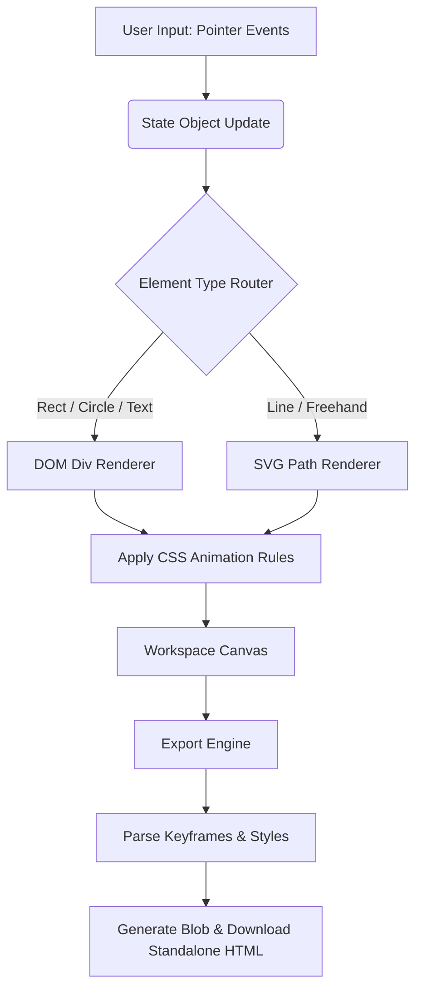

<h1 align="center">ShapeForge</h1>
<h3 align="center">Visual Animation Editor</h3>

<p align="center">
  A free, open-source visual animation editor built entirely for the browser. Draw shapes, add CSS animations, and export standalone HTML files directly to your device. No accounts, no server processing, no friction.
</p>

<p align="center">
  
  
  
  
</p>

---

## The Vision: Frictionless Design-to-Code

Modern animation tools are heavy, require active internet connections, and lock your data behind accounts. ShapeForge acts as a rapid, local-first prototyping ground. 

By leveraging raw DOM manipulation and SVG rendering, the engine allows you to draw elements, apply 16 built-in CSS animations, and instantly export a completely standalone HTML file. The exported file contains zero external dependencies—just pure HTML, CSS, and inline animations ready to be dropped into any project.

---

## Core Features & Engineering Decisions

* **16 Pre-built CSS Animations:** 
  The engine includes an internal dictionary (`AN` object) of 16 animations ranging from `slideLeft` and `bounceIn` to `rubberBand` and `zoomOut`. Users can configure duration, delay, iteration count, and easing functions without writing a single line of CSS.
* **Dual Rendering Engine (DOM & SVG):** 
  ShapeForge intelligently routes rendering based on the element type. Rectangles, circles, and text are rendered as standard DOM `div` elements for easy styling. Lines and freehand drawings are rendered as optimized SVG `<path>` elements using a quadratic curve algorithm (`pts2d`) for smooth, performant vector drawing.
* **Advanced Touch & Pointer Architecture:** 
  The canvas uses a custom `pointerdown`, `pointermove`, and `pointerup` event system that fully supports multi-touch gestures. It features a custom pinch-to-scale algorithm that calculates the distance between two pointers to resize elements on the fly, specifically optimized for Android tablet touch targets.
* **Standalone HTML Export Engine:** 
  The export function dynamically parses the internal state object (`S.els`), generates the required `@keyframes`, maps element coordinates and dimensions, and compiles it all into a single, clean `.html` file. It utilizes the native `Blob` and `URL.createObjectURL` APIs for seamless client-side downloading.
* **Snap-to-Grid & Smart History:** 
  Features a 20px snap-to-grid system for precise alignment. A custom undo/redo tracker (`S.undo` / `S.redo`) deep-clones the state array, allowing up to 40 levels of history reversal without memory leaks.

---

## Workflow Architecture

GitHub natively supports Mermaid.js diagrams. Below is the visual map of how ShapeForge processes user input into a standalone export:



---

## How to Use It

ShapeForge is deployed on Vercel and runs 100% client-side. 

### 1. Draw Your Asset
1. Open the deployed application.
2. Select a shape (Rect, Circle, Line, Text) from the left sidebar and drag it onto the canvas.
3. Use the **Freehand Draw** tool to sketch custom vectors. The engine automatically converts your raw points into a smoothed quadratic Bézier curve.
4. Tap any element to reveal 8 resize handles, or use two fingers to pinch and scale it dynamically.

### 2. Animate
1. Select an element to open the right-side **Properties** panel.
2. Scroll to the **Animation** section.
3. Choose an animation type from the 16 available presets.
4. Adjust Duration, Delay, Iteration (1 to infinite), and Easing.
5. Click **Preview** to watch the animation play directly on the canvas.

### 3. Export
1. Click the **Export** button in the top header.
2. The modal will display the generated, standalone HTML code.
3. Click **Copy Code** to paste it into your project, or **Download File** to save the `.html` file directly to your device.

---

## Keyboard Shortcuts

The editor includes a built-in event listener for rapid power-user workflows:

* **V:** Select Tool
* **P:** Freehand Draw Tool
* **Ctrl/Cmd + D:** Duplicate Selected Element
* **Ctrl/Cmd + Z:** Undo
* **Ctrl/Cmd + Shift + Z:** Redo
* **G:** Toggle Grid
* **Delete / Backspace:** Delete Selected Element
* **Escape:** Deselect

---

## Tech Stack

* **Vanilla JavaScript:** Zero frameworks. All state management, DOM manipulation, and gesture handling are written in raw, optimized JS.
* **Tailwind CSS:** Utility-first styling for the editor's dark-mode interface and layout structure.
* **Google Fonts:** Utilizes `Space Grotesk` for UI typography and `DM Sans` for body text.
* **Font Awesome:** Clean, scalable vector icons for the toolbar and shape cards.
```
