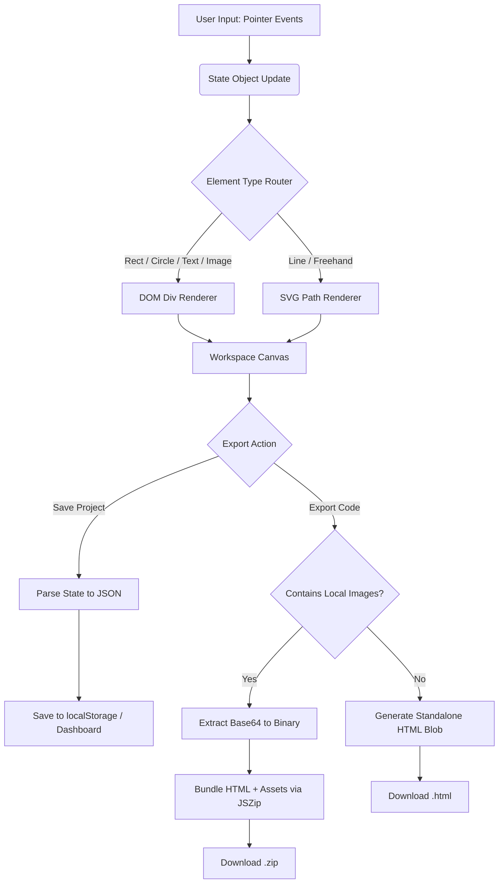

<h1 align="center">Stack</h1>
<h3 align="center">Visual HTML Builder</h3>

  A no-bullshit, local-first visual builder for developers. Design UI, drop elements, and export pure, standalone HTML files or ZIPs. Push to GitHub, connect Vercel, and deploy in seconds. No frameworks, no signups, no friction.

  
  
  
  

---

## The Vision: Pure Code, Visually Crafted

Modern website builders (Webflow, Framer) lock you into ecosystems and output bloated, framework-dependent code. Stack is built for the **Git-to-Vercel developer**. 

By operating entirely in the browser, Stack allows you to visually lay out DOM elements, apply CSS animations, and manage assets. When you're done, it compiles everything into a clean, dependency-free `index.html` file. If you use local images, it bundles them side-by-side in a ZIP file. You can drop this directly into a GitHub repo, connect Vercel, and your site is live.

---

## Core Features & Engineering Decisions

* **Local-First Project Management:** 
  Stack uses the browser's `localStorage` to save your entire project state. A custom dashboard dynamically loads your projects with live SVG thumbnails—generated by calculating element coordinates and rendering a miniature vector preview, ensuring you always know what's inside.
* **Smart Asset Bundling (JSZip):** 
  The export engine detects if you've uploaded local images. If so, it strips the massive Base64 strings from the HTML, extracts the raw binary data, and uses JSZip to bundle a clean `index.html` alongside your image files in a dynamically named `.zip` archive.
* **Brutalist Space-Saving UI:** 
  Replaced bulky side panels with a floating, dynamic context bar. Selecting an element spawns a compact toolbar at the top of the canvas for X/Y/W/H coordinates, color swatches, and direct text editing, maximizing your viewport space.
* **Advanced Touch & Pointer Architecture:** 
  The canvas uses a custom `pointerdown`, `pointermove`, and `pointerup` event system that fully supports multi-touch. It features a custom pinch-to-scale algorithm and specifically pauses CSS animations during drag/resize operations so elements don't disappear under your fingers.
* **Dual Rendering Engine (DOM & SVG):** 
  Stack intelligently routes rendering based on element type. Rectangles, circles, text, and images are rendered as standard DOM elements. Lines and freehand drawings are rendered as optimized SVG `<path>` elements using a quadratic curve algorithm (`pts2d`).

---

## Workflow Architecture

GitHub natively supports Mermaid.js diagrams. Below is the visual map of how Stack processes user input and manages exports:

---

## How to Use It

Stack is deployed on Vercel and runs 100% client-side. 

### 1. Dashboard & Projects
1. Open the deployed application to view the dashboard.
2. Click **Create New Project** to enter the editor (fullscreen mode).
3. Use the **Stack Menu** (top right) to Save, Save As, or Export your project as a `.json` file for backups. Projects auto-save to your browser's local storage.

### 2. Build & Animate
1. Drag shapes (Rect, Circle, Line, Text) from the left sidebar onto the canvas.
2. Tap an element to spawn the **Floating Context Bar** at the top. Edit coordinates, colors, stroke width, or click the **Edit** icon to type directly onto the canvas.
3. Click the **Animation** icon in the header to open the popover. Choose from 16 CSS animations, configure duration/easing, and hit Preview.

### 3. Export & Deploy
1. Click **Export HTML/Zip** in the menu.
2. If you only used URLs for images, a single, clean `index.html` file will download.
3. If you uploaded images from your device, a `.zip` file will download containing `index.html` and your images side-by-side.
4. Push the files to your GitHub repo and deploy via Vercel.

---

## Keyboard Shortcuts

The editor includes a built-in event listener for rapid power-user workflows:

* **V:** Select Tool
* **P:** Freehand Draw Tool
* **Ctrl/Cmd + D:** Duplicate Selected Element
* **Ctrl/Cmd + Z:** Undo
* **Ctrl/Cmd + Shift + Z:** Redo
* **G:** Toggle Grid
* **Delete / Backspace:** Delete Selected Element
* **Escape:** Deselect

---

## Tech Stack

* **Vanilla JavaScript:** Zero frameworks. All state management, DOM manipulation, and gesture handling are written in raw, optimized JS.
* **JSZip:** Used for client-side bundling of HTML and image assets into clean, deployable ZIP files.
* **Tailwind CSS:** Utility-first styling for the editor's brutalist dark-mode interface.
* **Google Fonts:** Utilizes `Space Grotesk` for UI typography and `DM Sans` for body text.
* **Font Awesome:** Clean, scalable vector icons for the floating toolbars and menus.
